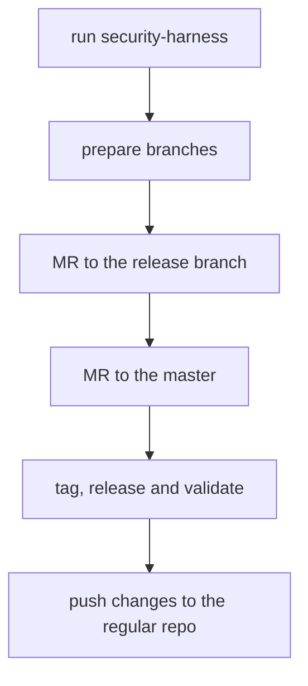

# Security Releases

This guide is based on the main [`gitlab-org/gitlab` security release process]

## DO NOT PUSH TO `gitlab-org/gitlab-vscode-extension`

As a developer working on a fix for a security vulnerability, your main concern is not disclosing the vulnerability or the fix before we're ready to publicly disclose it.

To that end, you'll need to be sure that security vulnerabilities are fixed in the [Security Repo].

This is fundamental to our security release process because the [Security Repo] is not publicly-accessible.

## Process

A security fix starts with an issue identifying the vulnerability. In this case, it should be a confidential issue on the `gitlab-org/gitlab-vscode-extension` project on [GitLab.com]

Once a security issue is assigned to a developer, we follow the same merge request and code review process as any other change, but on the [Security Repo].

### Schema



### Preparation

Before starting, add the new `security` remote on your local GitLab repository:

```sh
git remote add security git@gitlab.com:gitlab-org/security/gitlab-vscode-extension.git
```

Finally, run the `scripts/security-harness` script. This script will install a Git `pre-push` hook that will prevent pushing to any remote besides `gitlab.com/gitlab-org/security`, in order to prevent accidental disclosure.

Please make sure the output of running `scripts/security-harness` is:

```
Security harness installed -- you will only be able to push to gitlab.com/gitlab-org/security!
```

### Request CVE number

For exploitable security issues, request a CVE number by [creating an issue in `gitlab-org/cves` project](https://gitlab.com/gitlab-org/cves/-/issues/new). Use the assigned CVE number in the [changelog entry](https://gitlab.com/gitlab-org/gitlab-vscode-extension/-/blob/master/CHANGELOG.md#security).

Example CVE request: https://gitlab.com/gitlab-org/cves/-/issues/21

### Branches

The main objective is to release the security fix as a patch of the latest production release and backporting this fix on `master`.

#### Patch release branch

Before starting the development of the fix, create a branch from the latest released tag. You can see the latest released tag as [the extension version in the marketplace](https://marketplace.visualstudio.com/items?itemName=fatihacet.gitlab-workflow). For example, if the latest release has a tag `v.2.2.0` create a branch `security-2-2`. This is going to be the target of the security MRs. Push the branch to the security repo.

#### Security fix branch

Your fix is going to be pushed into `security-<issue number>` branch. If you work on issue #9999, you push the fix into `security-9999` branch.

```sh
git checkout security-2-2
git checkout -b security-9999
git push security security-9999
```

#### Backporting fix branch

This branch is going to serve for merging all the security fixes back to `master` branch. If you work on security release v2.2.1, you create the `security-backport-2-2` branch as follows:

```sh
git checkout master
git checkout -b security-backport-2-2
git push security security-backport-2-2
```

### Development

Here, the process diverges from the [`gitlab-org/gitlab` security release process].

1. **Before developing the fix, make sure that you've already run the `scripts/security-harness` script.**
1. Implement the fix and push it to your branch (`security-9999` for issue #9999).
1. Create an MR to merge `security-9999` to the patch release branch (`security-2-2`) and get it reviewed.
1. Merge the fix (make sure you squash all the MR commits into one).

### Release the change

Follow the [regular release process](release-process.md) to tag a new patch version on the `security-2-2` branch and release it. Patch release for tag `v2.2.0` would have version and tag `v2.2.1`.

Validate that the security issue is fixed in production.

### Backport the fix to `master`

1. Checkout the backporting branch `git checkout security-backport-2-2`
1. Cherry-pick all the fixes from the `security-2-2` branch.
1. Create an MR to merge this the backporting branch to `master`
1. Merge the MR

Example: https://gitlab.com/gitlab-org/security/gitlab-vscode-extension/-/merge_requests/4

## Push changes back to the [Extension Repo]

1. Push the patch tag to the [Extension Repo]
1. Merge the [Security Repo] `master` branch with the [Extension Repo] `master` and push to [Extension Repo]

[GitLab.com]: https://gitlab.com/
[Security Repo]: https://gitlab.com/gitlab-org/security/gitlab-vscode-extension
[`gitlab-org/gitlab` security release process]: https://gitlab.com/gitlab-org/release/docs/-/blob/master/general/security/developer.md
[Extension Repo]: https://gitlab.com/gitlab-org/gitlab-vscode-extension
